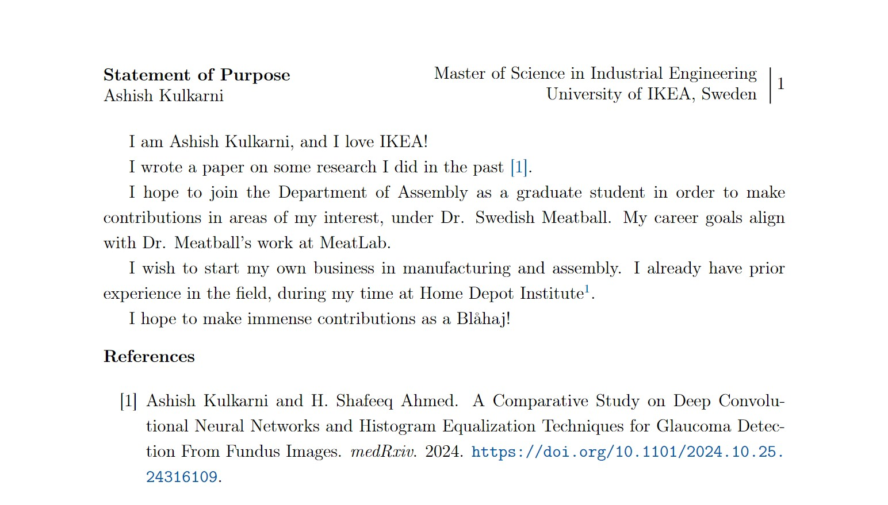
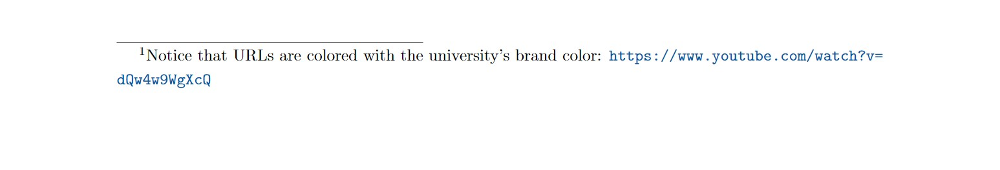

# sop-latex-template
A LaTeX template I used for my various statements while applying for graduate studies. You can use it for a Statement of Purpose, a Personal History Statement, an Academic and Professional Goals Statement, and more.

This template is inspired by [Swapnil Gandhi's template](https://github.com/Swapnil-Gandhi/SoP-Template).

Here is how the main content looks (references are optional, and usually not added in SOPs):


Here is how footers look:


School specific macros can be changed in a single file, to make things easier while editing your SOP for other applications.

```latex
% School specific macros
\newcommand{\schoolShort}{IKEA\xspace}
\newcommand{\school}{IKEA University\xspace}
\newcommand{\schoolLong}{University of IKEA, Sweden\xspace}
\newcommand{\schoolCity}{Sweden\xspace}
\newcommand{\student}{Blåhaj\xspace}

\newcommand{\depta}{Department of Assembly\xspace}

\definecolor{SchoolColorDark}{RGB}{1, 88, 168}
\definecolor{SchoolColorLight}{RGB}{251, 217, 21}

\newcommand{\programNameLong}{Master of Science in Industrial Engineering\xspace}
\newcommand{\programName}{MS in IE\xspace}

% professors
\newcommand{\drsm}{Dr. Swedish Meatball\xspace}
\newcommand{\drm}{Dr. Meatball\xspace}
\newcommand{\smlab}{MeatLab\xspace}
```
